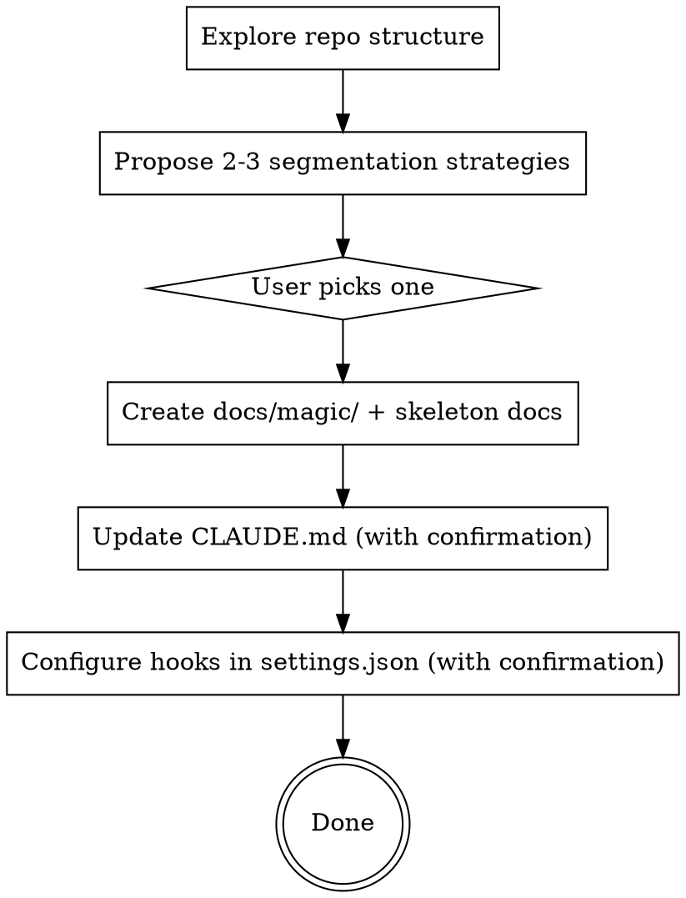

# Setup MagicDocs

Bootstrap a MagicDocs system in the current repository. Run once per repo.

MagicDocs are terse, auto-maintained architectural docs that capture non-obvious patterns, gotchas, design rationale, and entry points. They complement CLAUDE.md (behavioral constraints) by holding architectural knowledge that would otherwise go stale.

## Process



## Step 1: Explore

Read the repo structure. Identify major subsystems, entry points, and boundaries. Don't read every file — focus on top-level directories, key config files, and entry points.

## Step 2: Propose Segmentation

Present 2-3 segmentation strategies to the user with trade-offs. Common approaches:
- **By subsystem/domain** — "Authentication", "Billing", "Notifications"
- **By code boundary** — one doc per top-level directory
- **By entry point** — API server, worker queue, CLI tool
- **Hybrid** — directory-based for code, concern-based for cross-cutting

Do NOT pick one yourself. The user chooses.

## Step 3: Create Skeleton Docs

Create `docs/magic/` and one doc per segment. Every doc MUST use this exact format:

```markdown
# MAGIC DOC: <Title>

*<one-line description>*

## Overview

<2-3 sentences>

## Key Entry Points

<where to start reading>

## Non-Obvious Patterns

<gotchas, conventions, surprises>
```

Rules:
- Header MUST be `# MAGIC DOC: <Title>` — this exact format. The regex `^# MAGIC DOC:` is how the system discovers docs.
- Italicized one-liner MUST follow the header immediately.
- **BE TERSE.** Each doc under 500 words. No exhaustive lists of files, routes, functions, or parameters. No implementation details. Document WHY things exist, HOW components connect, WHERE to start reading, WHAT patterns are non-obvious.
- Add a `## Dependencies` section only if the subsystem has non-obvious external dependencies.
- Do NOT create a README or index file in `docs/magic/` — discovery is handled by the `# MAGIC DOC:` header convention.

## Step 4: Update CLAUDE.md

Ask the user for confirmation, then append these two items to CLAUDE.md (create it if it doesn't exist):

```markdown
Architectural documentation is maintained in docs/magic/ and may also be
co-located with code (grep for `# MAGIC DOC:` headers). Read the relevant
Magic Doc before making changes to a subsystem you're unfamiliar with.

Files with `# MAGIC DOC:` headers are auto-maintained by the magicdocs
system. Changes to these files may appear in unstaged diffs — this is
expected.
```

## Step 5: Configure Hooks

Ask the user for confirmation, then add to `.claude/settings.json`:

**Stop hook** — pruning pass at session exit:
```json
{
  "hooks": {
    "Stop": [{
      "hooks": [{
        "type": "command",
        "command": "if git diff --stat HEAD 2>/dev/null | grep -q '.'; then claude -p 'Check the git diff against existing magic docs (grep for files with # MAGIC DOC: headers). If any doc references files, paths, or structures that changed in the diff, update those references in-place. Do NOT add new architectural insights — only fix inconsistencies between docs and current code state. Be terse. If nothing is inconsistent, make no edits.' --model sonnet --allowedTools 'Glob,Read,Edit,Grep' 2>/dev/null & fi"
      }]
    }]
  }
}
```

Merge with existing hooks if any are already configured.

## Prerequisite

The airbender plugin must be installed as a Claude Code skills plugin. This provides `/create-magicdoc` and `/classify-info` — the companion skills that create individual docs and route insights to the update subagent.

## What This Does NOT Do

- Does not install companion skills — those come from the airbender plugin
- Does not set up automatic insight dispatch — that works through `/classify-info` in the main agent's normal workflow
- Does not enable Agent Teams — that's an optional upgrade the user can add later
